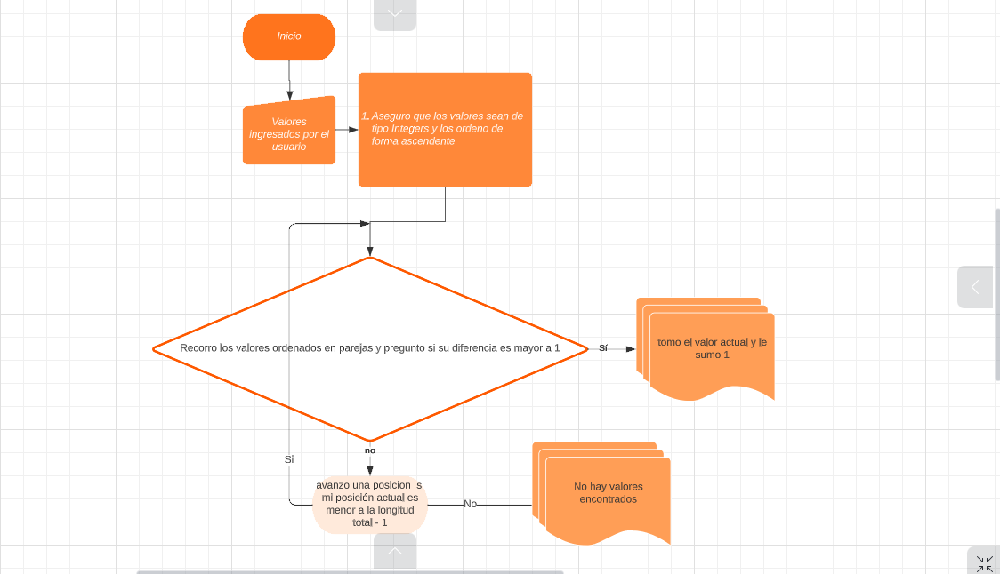

## Objetivos del Challenge

- Desarrolle una página web utilizando HTML, CSS y JavaScript para encontrar el número faltante en un conjunto de números enteros siguiendo las siguientes condiciones:
- El conjunto de enteros se creará a través de un campo de entrada donde los números se separarán por comas.
- Se debe incluir un botón para encontrar el número faltante en el conjunto.
- El número encontrado se mostrará en una etiqueta (label) separada.

## BoilerPlate

El boilerplate cuenta con una carpeta: `challengequestion2and3`. En esta carpeta estará el código del front-end respectivamente.

#### Tecnologías implementadas:
- [ ] Javascript
- [ ] HTML
- [ ] CSS
- [ ] ReactJs

## Comenzando
1. Clonar el repositorio.
 - git clone https://github.com/careyesp95/challengequestion2and3.git

 2. instalar las dependencias en `challengequestion2and3` utlilizando `npm install` y para levantar la APP `npm start`

- Diagrama de flujo, corresponde a la pregunta 3.

  

